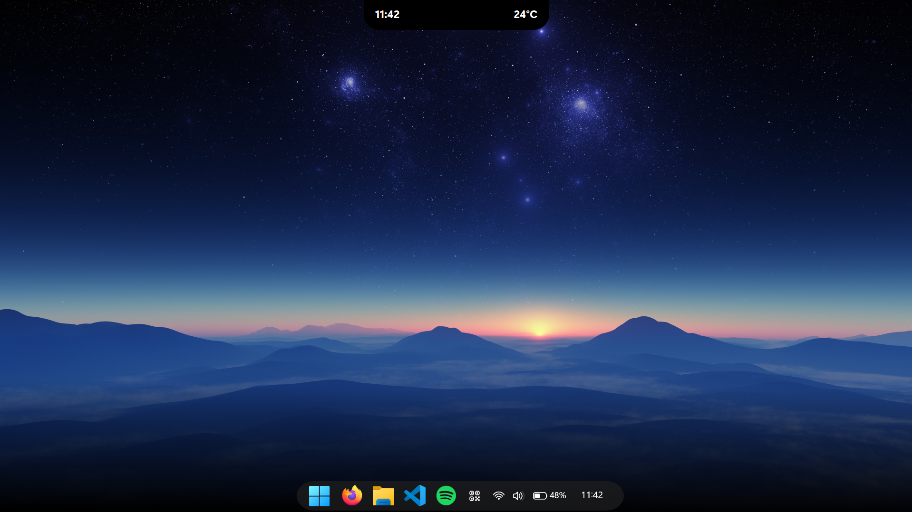
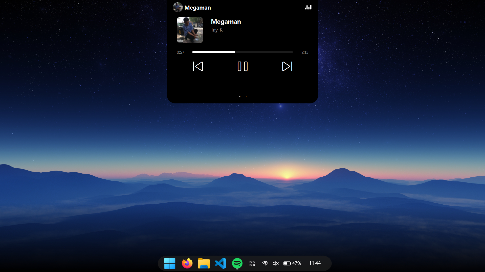

<div align="center">

# 🏝️ Dynamic Island for Windows

**A sleek, fluid, and modern multitasking experience brought to the Windows desktop.**

[](https://denisdev.online/projects/dynamic_island/index.html)
[](https://github.com/)
[](https://github.com/)

<br/>

<p align="center">
  <b>Seamlessly docks at the top of your screen, morphing dynamically based on what you're doing.</b>
</p>

[Explore Website](https://denisdev.online/projects/dynamic_island/index.html) • [Download Setup](#-quick-install-installer) • [Run Script (.pyw)](#-run-standalone-script-pyw) • [Features](#-core-features)

---

</div>

<div align="center">
  
</div>

## 🌟 Overview

**Dynamic Island for Windows** bridges the gap between clean aesthetics and practical desktop utilities. Built to deliver native-feeling responsiveness, it stays docked unobtrusively at the top of your display, dynamically expanding to reveal media controls, smart notifications, system stats, and quick settings without interrupting your workflow.

---

<div align="center">
  
</div>

## ⚡ Core Features

<div align="center">
  <table>
    <tr>
      <td width="50%" align="center">
        
        <br/><b>🎵 Smart Media Controller</b><br/>
        <i>Track titles, artist info, 60FPS audio visualizer, and media controls.</i>
      </td>
      <td width="50%" align="center">
        
        <br/><b>📊 Customizable Right Widget</b><br/>
        <i>Choose what you want to see: Live Weather, CPU Usage, RAM Usage, or Battery level.</i>
      </td>
    </tr>
    <tr>
      <td width="50%" align="center">
        
        <br/><b>🔔 Windows Notification Center</b><br/>
        <i>Catches native Windows Toast Notifications and displays them beautifully in a dedicated tab.</i>
      </td>
      <td width="50%" align="center">
        
        <br/><b>🎨 Advanced Control Panel</b><br/>
        <i>Customize X/Y positions, dimensions, opacity, custom colors, and preset themes on the fly.</i>
      </td>
    </tr>
  </table>
</div>

### 🎨 Visual & Performance Highlights
- **Stunning Themes:** Choose between *Default Total Black*, *Apple Glass (Aero Blur)*, *Dark Neon*, *Midnight Blue*, and *Sunset Gold*.
- **Completely Borderless:** Ultra-clean design that blends flawlessly with your desktop.
- **Smart Display Modes:** Choose between *Always Idle*, *Auto-Hide (15s)*, or *Fixed (Visible over Fullscreen/Games)*.
- **Micro-Animations:** Smooth expansion, morphing physics, and seamless page-scrolling using the mouse wheel or arrow keys.
- **Resource Efficient:** Built with `PyQt6`, keeping background hardware usage extremely low.

---

## 🚀 Quick Install (Installer)

Download the official preconfigured setup directly from here:

👉 **[Download Dynamic Island](https://denisdev.altervista.org/DynamicIsland-Setup.exe)**

1. Download the executable **`DynamicIsland-Setup.exe`**.
2. Run the guided installer (installs files, creates desktop and Start Menu shortcuts).
3. Check the **"Start with Windows"** option if you want it to launch automatically upon startup.
4. Hit finish and enjoy your Dynamic Island!

---

## 🐍 Run Standalone Script (.pyw)

If you prefer not to use the installer and want a lightweight folder containing only the Python script:

1. **Create a folder** (e.g., `DynamicIsland`) and place the **`dynamic-island.pyw`** script inside.
2. Make sure you have **Python 3.10+** installed with the *"Add python.exe to PATH"* option checked.
3. Open your terminal (Command Prompt or PowerShell) inside the folder and install the required packages. *(Note: We transitioned to PyQt6 for better performance and animations!)*:

```bash
pip install PyQt6 psutil requests screen-brightness-control winsdk
